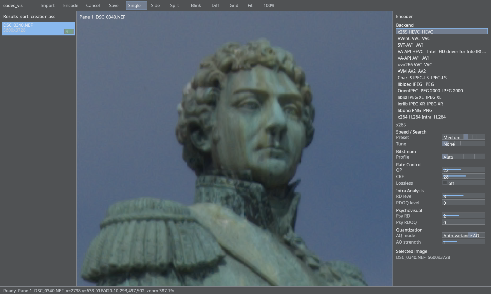
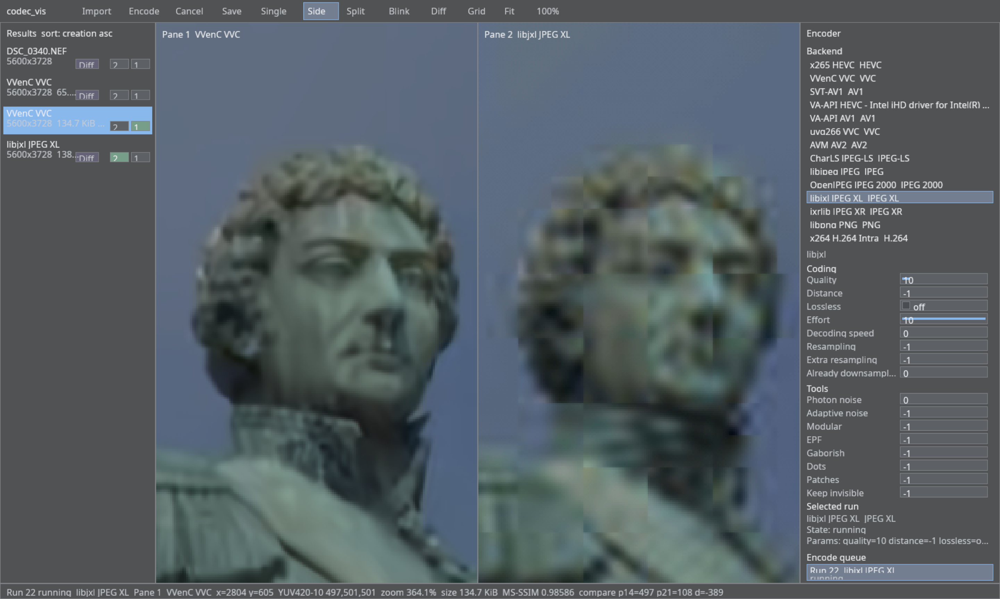
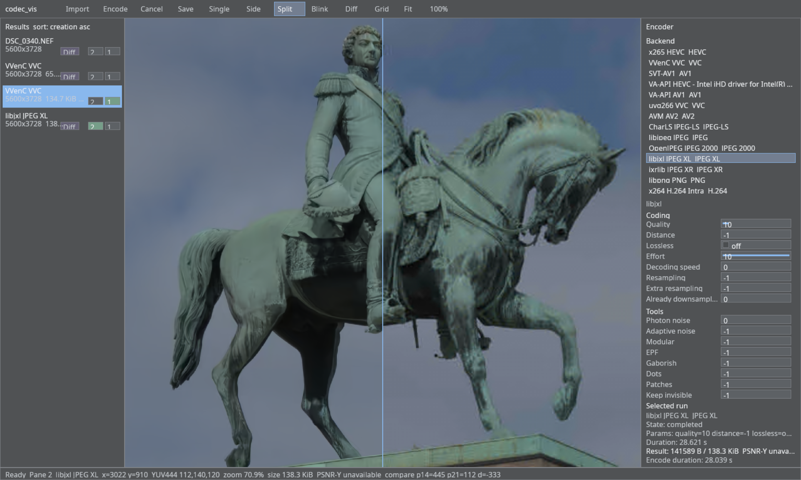
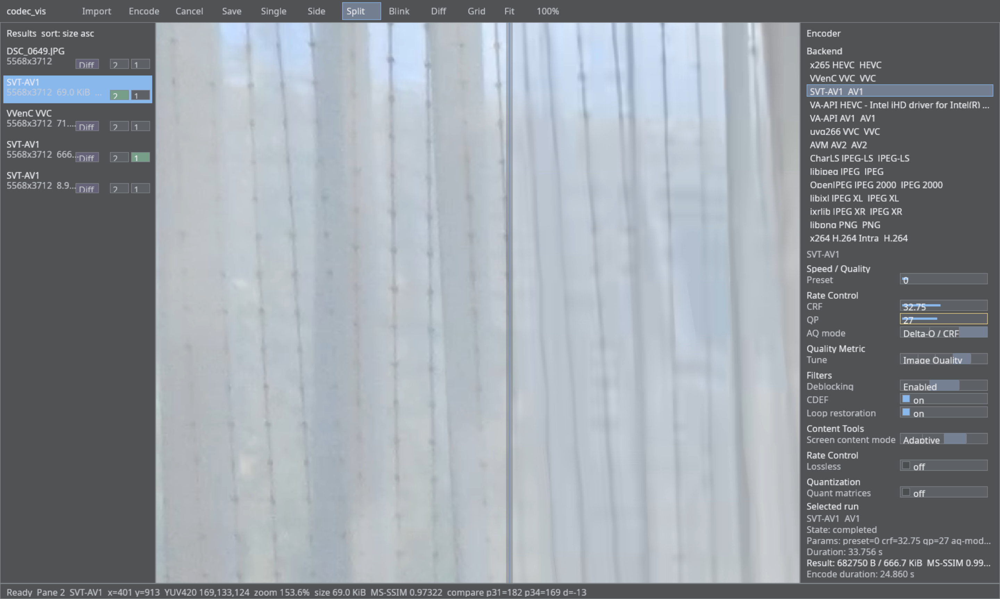
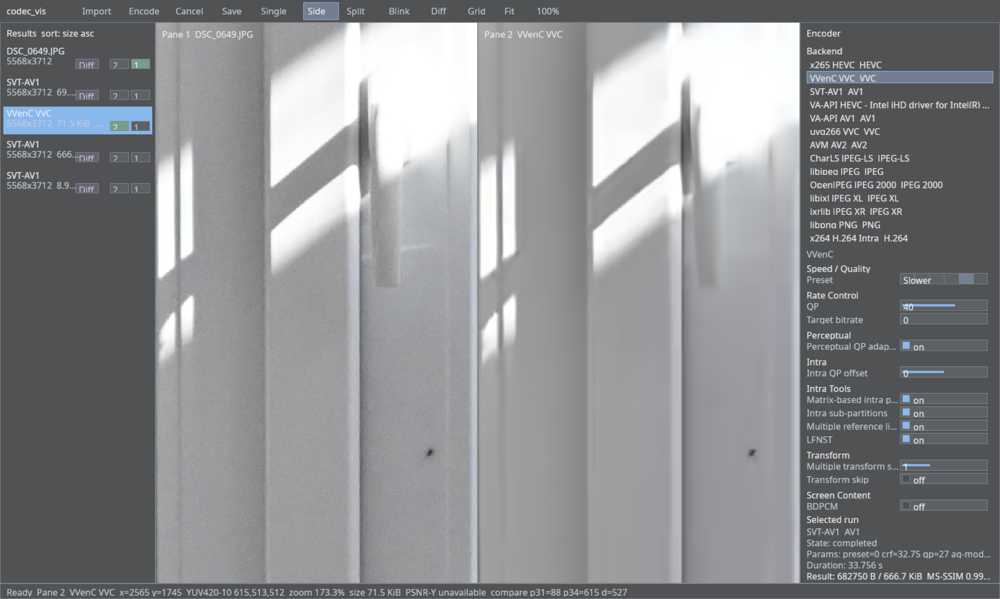

WARNING: This entire codebase is 100% written by GPT-5.5 without any human review.

GPT-5.5 refuses to test the code it writes and did not bother hooking up many encoders, even after many requests to do so from my side. It literaly gave as an excuse once that the source image is a good enough apporximation and given its higher image quality it is likely improving the UX to not hook up the encoder. There are a lot of features that I requested but that GPT-5.5 ended up claiming that it is good enough to add bit depth and chroma subsampling configuration for only one encoder and that adding this to all the others is too much work. Due to the refusal to test the code, this code will crash often. Good luck getting this code to work on anything else but my machine. The UI sucks and you will likely not know how to use this tool correctly. I make no guarantee that this implementaion let's you compare codecs in good faith and that there are not any misconfigurations.

# codec_vis

`codec_vis` is a still-image codec comparison tool. It imports large source images, runs them through installed encoder backends, and lets you inspect the visual result, encoded size, encode time, and metrics in one GUI.



## Features

- Import JPEG and RAW still images for codec testing.
- Encode the same source through multiple software and hardware backends.
- Compare source and encoded results in single, side-by-side, split, blink, diff, and grid views.
- Sort runs by creation order, size, and other run metadata.
- Inspect per-backend parameters from the right-side encoder panel.
- Track encoded byte size, duration, PSNR, and MS-SSIM when available.

## Screenshots

Side-by-side comparison between VVenC and JPEG XL:



Split comparison against JPEG XL:



Split comparison against SVT-AV1:



Side-by-side comparison against VVenC:



## Build

The project uses a plain `Makefile` and `pkg-config`.

```sh
make
```

The default target builds the CLI, the GUI, and the test binaries.

To build only one frontend:

```sh
make codec_vis_cli
make codec_vis_gui
```

## Test

```sh
make test
```

## Run

```sh
./codec_vis_gui
./codec_vis_cli --help
```

Encoder availability depends on the libraries and command-line tools installed on the system. The GUI lists the usable backends at runtime.

## Repository Layout

- `main.cpp`: CLI entry point.
- `gui/`: GUI model, rendering, input, layout, and tests.
- `codec_gui_*.cpp`: codec backends and still-image I/O.
- `docs/`: release notes, capability notes, and screenshots.
- `Makefile`: build and test targets.
